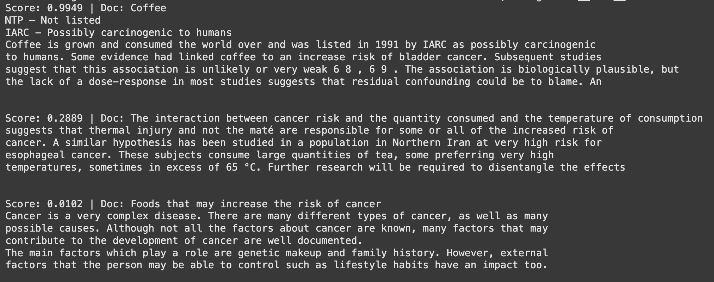
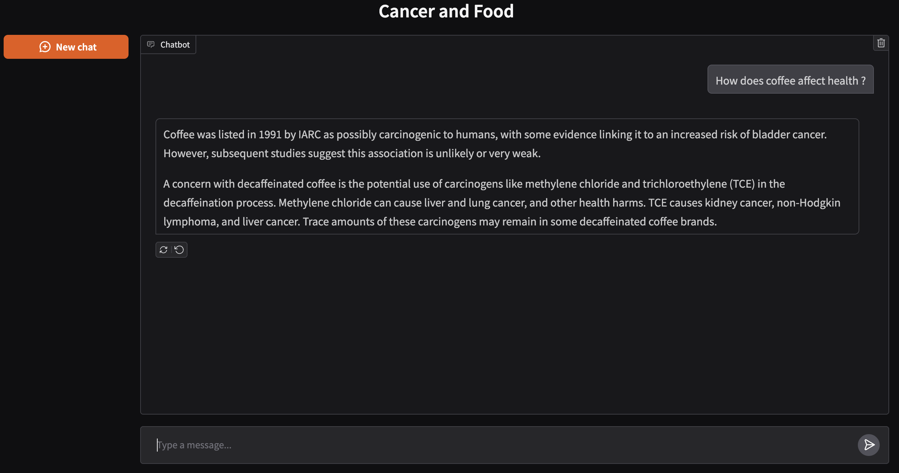
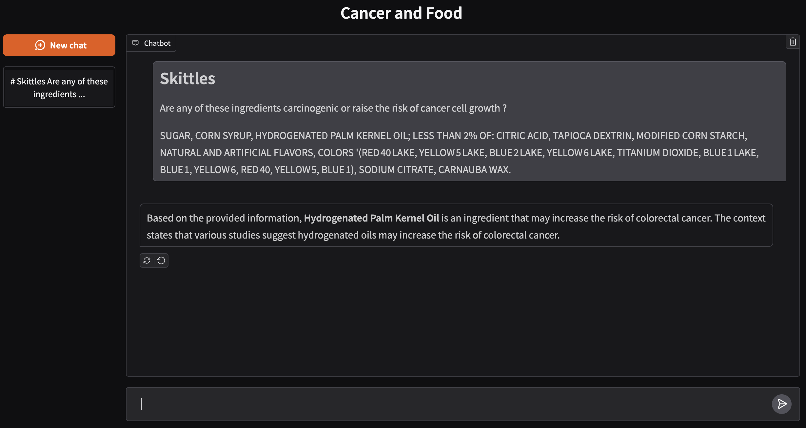

# LLM Powered Food-Cancer Chatbot

## Table of contents
* [Overview](#overview)
* [Motivation](#motivation)
* [Project Goal](#project-goal)
* [Architecture and Design](#architecture-and-design)
  * [System Design](#system-design)
  * [Architecture](#architecture)
* [Embeddings, Vector Database and Reranker](#embeddings-vector-database-and-reranker)
  * [Embeddings](#embeddings)
  * [Vector Database](#vector-database)
  * [Reranker](#reranker)
* [Usage](#usage)
* [Future Improvements](#future-improvements)
* [Author](#author)

## Overview
The goal of this project is to develop a personalized AI chatbot that analyzes food ingredients and provides insights into their potential links with cancer risk. Unlike standard LLM-based chatbots, this system integrates a Retrieval-Augmented Generation (RAG) pipeline with vector embeddings, enabling more accurate and research driven responses.

With the help of embeddings, this chatbot can retrieve relevant scientific and nutritional information about food items, then use the LLM to generate context-aware explanations. This ensures that users receive personalized, evidence informed insights on how specific foods and ingredients may influence cancer risk.

## Motivation
I have always been curious about why the United States ranks among the highest in cancer cases worldwide. While a larger population naturally contributes to higher numbers, I realized that food choices and lifestyle factors play a major role in cancer risk. This curiosity inspired me to explore the intersection of nutrition, health, and AI, and to take my first steps into building a system that could help raise awareness and provide personalized insights.

## Project Goal
The main objective of this project is to provide users with accessible, personalized insights into how specific food ingredients may be associated with an increased risk of cancer. 

## Architecture and Design

#### System Design
This project is designed as a personalized AI assistant that integrates natural language processing with domain-specific knowledge about food and cancer risk.

#### Architecture
The system follows a Retrieval-Augmented Generation (RAG) pipeline, combining embeddings with an LLM to provide contextually accurate responses. To increase the quality of best matching responses I added a **Reranker** function as well as **Bleu Score Evaluation**.

* **User Query** → User asks about food or ingredients.

* **Embedding Generation** → The query is converted into vector embeddings.

* **Vector Database Search** → Embeddings are compared against a database, in our case we used Chroma database.

* **Context Retrieval** → Relevant passages/documents are retrieved.

* **Reranker** → Best 3 matched answers from Context Retrieval are passed to Reranker. The Reranker function matches the best result of all 3 and passes as a best matched response to the context of the PromptTemplate. 

* **LLM Integration** → The LLM uses both the user query and prompt to generate a final, personalized response.

## Embeddings, Vector Database and Reranker

#### Embeddings 
In our scope we use **Qwen3-Embedding-0.6B** embedding model, but 4B and 8B options are also available. Upon ingesting documents into the embedding model, documents are splitted in 500 words with 50 word overlaps.

#### Vector Database 
For the vector database we used **Chroma** database.

#### Reranker
Qwen3-Reranker-0.6B reranker is used.

Below is a test measurement of the reranker function

## Usage
These are some sample queries and conversation screenshots

## Future improvements

One of the next goals for this project is to add multimodal support. In this context, that means enabling the system to work not only with text input but also with images of food ingredients. For example, a user could upload a photo of a nutrition label, and the system would detect the ingredients before analyzing their potential cancer risks.

## Author

- [@davprog9](https://www.github.com/davprog9)

